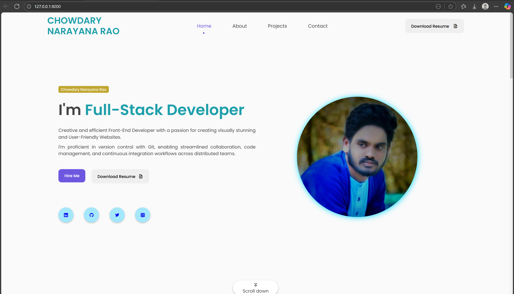
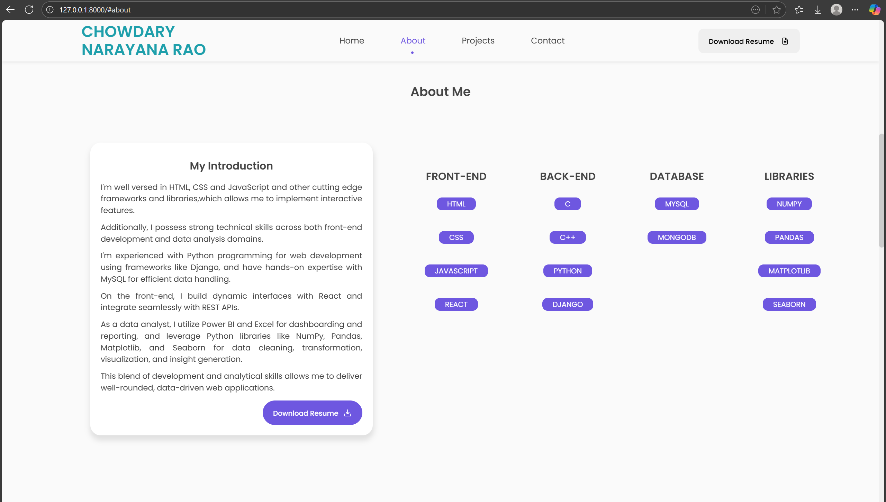
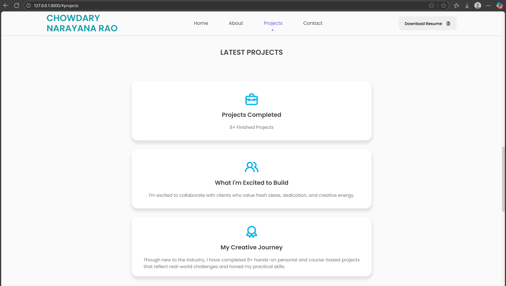
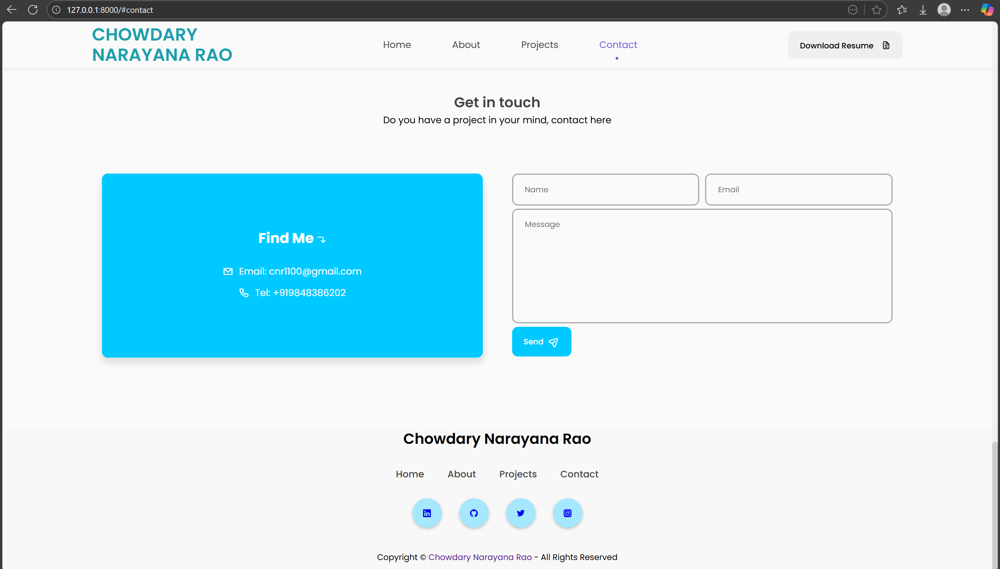

# 🧑‍💻 Chowdary Narayana Rao — Full-Stack Developer Portfolio

🔗 **Live Demo:** [Visit Portfolio on PythonAnywhere](https://cnr1100.pythonanywhere.com)

## 🧠 Django Portfolio Project 

A secure, full-stack personal portfolio built with Django, showcasing my technical skills, creative projects, and professional journey. This site reflects my passion for building user-friendly web applications and data-driven solutions.

---

## 🧭 Table of Contents

- [🚀 Features](#-features)
- [🛠️ Tech Stack](#%EF%B8%8F-tech-stack)
- [📸 Screenshots](#-screenshots)
- [📦 Setup Instructions](#-setup-instructions)
- [🙋‍♂️ About Me](#%EF%B8%8F-about-me)
- [📞 Contact](#-contact)
- [📜 License](#-license)

---

## 🚀 Features

- 🔐 Secure Django backend with environment variable management
- 📧 SMTP email integration for contact form
- 🗄️ MySQL database setup for dynamic content
- 📄 Resume download functionality
- 🧰 Categorized skill showcase (Front-End, Back-End, Database, Libraries)
- 🎨 Responsive design using Bootstrap and custom CSS
- 🌐 Social media integration (LinkedIn, GitHub, Twitter, Instagram)

---

## 🛠️ Tech Stack

| Category      | Technologies                                                                 |
|---------------|-------------------------------------------------------------------------------|
| 🖥️ Front-End   | HTML, CSS, JavaScript, React                                                 |
| 🧠 Back-End     | Python, Django, C, C++                                                       |
| 🗃️ Database     | MySQL, MongoDB                                                               |
| 📊 Data Analysis| Power BI, Excel, NumPy, Pandas, Matplotlib, Seaborn                          |
| 🛠️ Tools        | Git, GitHub, VS Code                                                         |

---

## 📸 Screenshots

### 🏠 Homepage
  
Introduces me as a Full-Stack Developer with Git-powered workflows and a focus on clean, efficient design. Includes "Hire Me" and "Download Resume" buttons, plus social media links.

### 👨‍💻 About Section
  
Highlights my technical stack across front-end, back-end, databases, and data analysis. Features Django, React, MySQL, and Python libraries like Pandas and Matplotlib.

### 🧪 Projects Section
  
Showcases 8+ completed projects, creative aspirations, and hands-on experience. Emphasizes readiness to collaborate and solve real-world challenges.

### 📬 Contact Page
  
Includes a contact form, email and phone details, and social media links. Encourages collaboration and project inquiries.

---

## 📦 Setup Instructions

### 🔧 Step-by-Step Installation

| Step | Command / Action                                                                 |
|-------|----------------------------------------------------------------------------------|
| 1️⃣   | Clone the repository: `git clone  https://github.com/cnr1100/portfolio-website-cnr1100.git`|                                         
| 2️⃣   | Navigate to project folder: `cd portfolio-website-cnr1100`                        |
| 3️⃣   | Create virtual environment: `python -m venv venv`                                |
| 4️⃣   | Activate virtualenv: `.\venv\Scripts\activate` (Windows)|
| 5️⃣   | Install dependencies: `pip install -r requirements.txt`                          |
| 6️⃣   | Create `.env` file and add your environment variables                            |
| 7️⃣   | Run migrations: `python manage.py migrate`                                       |
| 8️⃣   | Start development server: `python manage.py runserver`                           |
| ✅   | Visit `http://127.0.0.1:8000/` in your browser                                   |

---

## 🙋‍♂️ About Me

Hi, I’m Chowdary Narayana Rao — a meticulous and security-conscious Full-Stack Developer with a passion for building clean, scalable, and data-driven applications.

### 💼 What I Do

- 🧠 Backend Development Expert in Python, Django, and SQL — building robust APIs, managing databases, and ensuring secure deployments.

- 🎨 Frontend Engineering Skilled in React — crafting responsive, user-friendly interfaces that connect seamlessly with backend logic.

- 📊 Data Analytics & BI Development Experienced in transforming raw data into actionable insights using Python, SQL, and Business Intelligence tools like Power BI and Tableau.

- 🔐 Security & Professional Presentation I follow best practices for environment management, sensitive data protection, and clean GitHub workflows — including .gitignore, licensing, and polished READMEs with icons and tables.

### 🚀 What You’ll Find in My Work

- Modular Django apps with reusable components

- Clean RESTful APIs and MySQL integration

- SMTP-enabled contact forms and admin dashboards

- Visual clarity with screenshots, navigation tables, and recruiter-friendly documentation

- Secure deployment on platforms like PythonAnywhere

---

## 📬 Contact

- 📧 [cnr1100@gmail.com](mailto:cnr1100@gmail.com)

- 🔗 [LinkedIn](https://www.linkedin.com/in/cnr1100)  

- 💻 [GitHub](https://github.com/cnr1100)

---

## 📜 License

This project is licensed under the [MIT License](LICENSE).

---

